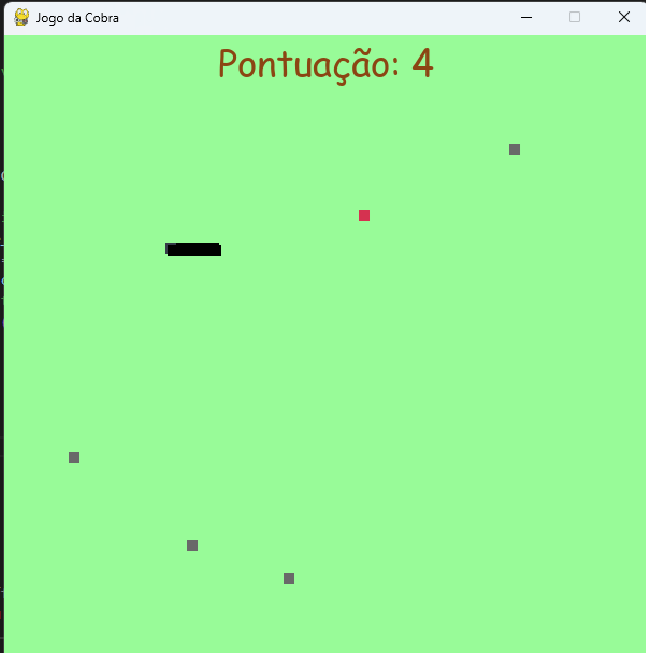

# Jogo da Cobra - Pygame

Este é um projeto simples de **Jogo da Cobra** desenvolvido utilizando a biblioteca **Pygame** em Python. O jogo segue o conceito clássico onde a cobra cresce à medida que come o ponto alvo e o jogador deve evitar colisões com as bordas da tela, seu próprio corpo ou com barreiras que aparecem conforme o jogo avança.

## Funcionalidades

- A cobra se move pelas setas do teclado.
- Cada vez que a cobra come o ponto alvo (vermelho), a cobra cresce e barreiras aleatórias aparecem no campo de jogo, tornando o desafio mais difícil.
- O jogo termina se a cobra colidir com as bordas da tela, seu próprio corpo ou com as barreiras.
- Após a derrota, o jogo exibe uma mensagem de fim de jogo e oferece as opções de:
  - **Q** para sair do jogo.
  - **C** para reiniciar o jogo.

## Instalação

### Pré-requisitos

- **Python 3.x**: Certifique-se de ter o Python 3 instalado no seu computador.
- **Pygame**: A biblioteca Pygame deve ser instalada para que o jogo funcione corretamente.

### Como instalar

1. Clone o repositório:

```bash
git clone https://github.com/SEU-USUARIO/nome-do-repositorio.git
```

2. Navegue até o diretório do projeto:

```bash
cd nome-do-repositorio
```

3. Instale o Pygame:

```bash
pip install pygame
```

4. Execute o jogo:

```bash
python snake.py
```

# Como Jogar

Movimentação: Use as setas direcionais (cima, baixo, esquerda, direita) para mover a cobra.
Objetivo: Coma os pontos vermelhos para crescer e evitar as barreiras que surgem no caminho.
Game Over: A partida termina se a cobra bater nas bordas da tela, no próprio corpo ou nas barreiras.
Após o game over, a mensagem de fim de jogo será exibida, com as opções para sair ou reiniciar o jogo.

# Tecnologias Utilizadas

Python 3.x
Pygame: Para a criação da interface gráfica e interação com o jogo.

# Como Funciona

Tela de Jogo: A tela do jogo tem uma dimensão de 600x600 pixels e o fundo possui um tom de verde pastel.
A Cobra: A cobra é representada por uma sequência de blocos quadrados, sendo a cabeça de uma cor diferente.
A Comida (Ponto Alvo): O ponto alvo que a cobra deve comer é representado por um quadrado vermelho.
Barreiras: A cada vez que a cobra come um ponto alvo, novas barreiras aleatórias são geradas, tornando o jogo mais desafiador.
Mensagens de Game Over: O jogo exibe uma mensagem de fim de jogo no centro da tela com opções de reiniciar ou sair.

# Captura de Tela



# Contribuições

Contribuições são bem-vindas! Se você tiver sugestões ou melhorias para o jogo, sinta-se à vontade para abrir uma issue ou enviar um pull request.

# Licença

Este projeto está licenciado sob a Licença MIT - veja o arquivo LICENSE para mais detalhes.
